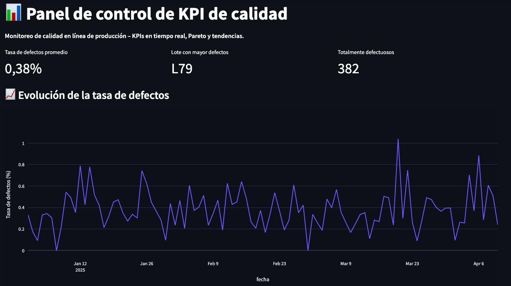
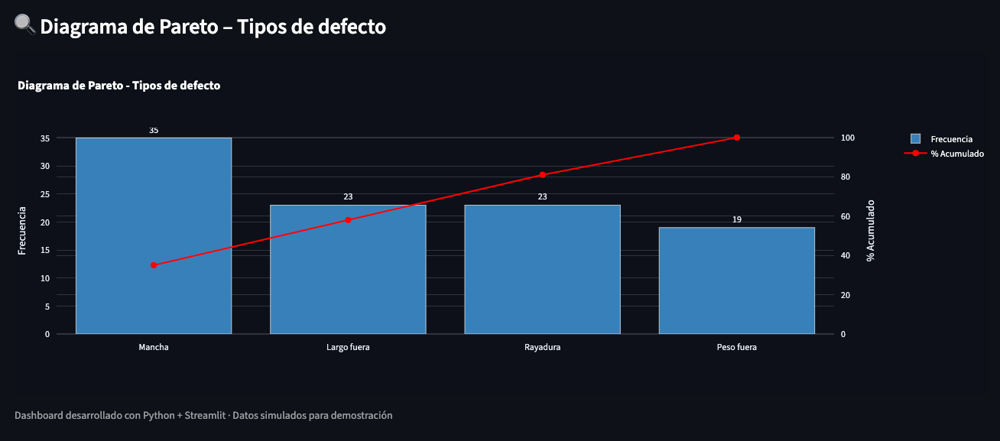

# 📊 Quality KPI Dashboard

[](https://www.python.org/)
[](https://streamlit.io/)
[](LICENSE)

**Panel de control de KPIs de calidad industrial**, con cálculo real de FPY, tasas de scrap/reproceso, diagrama de Pareto, comparación operacional (línea/turno/máquina) y análisis de capacidad de proceso (Cp/Cpk) según metodología Six Sigma.

---

## 📌 Problema industrial abordado

Una línea de envasado con **2 líneas, 4 máquinas y 3 turnos** necesita monitorear su desempeño de calidad para identificar dónde se concentran los defectos, comparar desempeño entre máquinas/turnos, y verificar si el proceso es estadísticamente capaz de cumplir especificaciones (Cp/Cpk).

## 🎯 Objetivos

1. Calcular KPIs descriptivos de calidad (FPY, tasa de defectos, scrap, reproceso).
2. Identificar concentración de causas de defecto (Pareto 80/20).
3. Comparar desempeño por línea, máquina, turno y operador.
4. Evaluar capacidad de proceso (Cp/Cpk) de variables críticas.
5. Generar conclusiones accionables, no solo gráficos.

---

## 📊 Datos y metodología

**Los datos son 100% simulados**, generados por `src/data_generator.py` con semilla fija (`random_seed=42`) para reproducibilidad total. Supuestos documentados:

- 2 líneas, 2 máquinas cada una (4 total). **M04 tiene +1.5 p.p. de tasa de defecto base**, simulando desgaste mecánico — cuello de botella intencional del dataset.
- 3 turnos. **Turno Noche tiene +0.8 p.p.**, reflejando el efecto de fatiga/menor supervisión documentado en literatura de calidad.
- De las unidades defectuosas: 70% reproceso, 30% scrap.
- 250 lotes — tamaño elegido para que Cp/Cpk sea estadísticamente estable (mínimo recomendado: n≥30).

Fórmulas (ver `src/kpis.py` y `src/capability.py`):
```
FPY = (producidas - defectuosas) / producidas
Cp = (USL - LSL) / (6 * sigma)
Cpk = min[(USL - media)/(3sigma), (media - LSL)/(3sigma)]
```

---

## 📈 Resultados clave (reproducibles — se recalculan al correr el dashboard)

- **FPY global: 95.7%** | Tasa de scrap: 1.29% | Tasa de reproceso: 2.97%
- **M04** concentra la mayor tasa de defectos (5.4% vs. 3.8-4.1% del resto) — candidata prioritaria a mantenimiento preventivo.
- **Turno Noche** presenta la peor calidad (4.9% vs. 3.9% en Mañana).
- **Cpk = 1.13 (Peso)** y **Cpk = 1.01 (Longitud)** — ambas variables en zona "Marginal" (1.00 <= Cpk < 1.33): el proceso cumple especificación pero sin margen de seguridad.

---

## 📸 Capturas del panel

**Panel principal — KPIs críticos y evolución de la tasa de defectos**


**Análisis de causa raíz, comparación operacional y capacidad de proceso (Cp/Cpk)**


---

## 🛠️ Stack tecnológico

| Herramienta | Uso |
|---|---|
| Python 3.11 | Lenguaje base (compatibilidad con pyarrow en macOS antiguos) |
| Streamlit 1.30 | Dashboard interactivo |
| Plotly | Gráficos interactivos |
| Pandas / NumPy | Procesamiento de datos |
| PyYAML | Configuración externalizada |
| Pytest | Suite de 11 tests unitarios |

---

## ⚙️ Instalación y ejecución rápida

```bash
# Clonar repositorio
git clone https://github.com/icqdgonzalezs/quality-kpi-dashboard.git
cd quality-kpi-dashboard

# Crear entorno virtual
python3 -m venv venv
source venv/bin/activate   # Windows: venv\Scripts\activate

# Instalar dependencias
pip install -r requirements.txt

# Ejecutar el dashboard
streamlit run dashboard/app.py
```

**⚠️ Nota de compatibilidad (macOS 10.14 Mojave o anterior):** este proyecto requiere **Python 3.11**, no 3.13+. `pyarrow` (dependencia de Streamlit) no publica binarios precompilados para Python 3.13 en macOS antiguos. Instalar Python 3.11 desde [python.org](https://www.python.org/downloads/) si es necesario.

```bash
# Opciones avanzadas

# Regenerar el dataset simulado (250 lotes, semilla fija reproducible)
python3 -m src.data_generator

# Correr la suite de tests (11 casos)
pytest tests/ -v
```

---

## 📁 Estructura del proyecto

```
quality-kpi-dashboard/
├── config/
│ └── quality_config.yaml # LSL/USL, umbrales Cpk (Six Sigma)
├── dashboard/
│ └── app.py # Aplicacion Streamlit (punto de entrada)
├── data/
│ └── calidad_muestra.csv # 250 lotes simulados (linea/maquina/turno/operador)
├── src/
│ ├── data_generator.py # Generador de datos (supuestos documentados)
│ ├── kpis.py # FPY, scrap, reproceso, Pareto
│ └── capability.py # Cp/Cpk (metodologia Six Sigma)
├── tests/
│ ├── test_kpis.py # 6 casos
│ └── test_capability.py # 5 casos (11 tests, todos passing)
├── imagenes/ # Capturas del dashboard para el README
├── .github/
│ └── workflows/
│ └── tests.yml # CI: pytest automatico en cada push
├── requirements.txt # Dependencias con versiones fijadas
├── LICENSE # MIT License
└── README.md 
```


---

## 🔎 Conclusiones y líneas de mejora futuras

1. **M04** requiere revisión de mantenimiento preventivo — principal contribuyente a la tasa de defectos.
2. El **Cpk marginal** en ambas variables sugiere que el proceso no tiene margen de seguridad ante variabilidad adicional — se recomienda reducir sigma antes de ampliar limites de especificacion.
3. Lineas futuras: carta de control estadistico (X-barra/R) para detectar causas asignables en tiempo real; incorporar datos reales de planta cuando esten disponibles.

---

## 👤 Autor

**David Camilo González Santibáñez** – Ingeniero Civil Químico | Data Analytics | Mejora Continua

[](https://linkedin.com/in/davidgonzalezsz)
[](https://github.com/icqdgonzalezs)

---

**Proyecto desarrollado como parte del portafolio profesional en análisis de datos industriales.**
